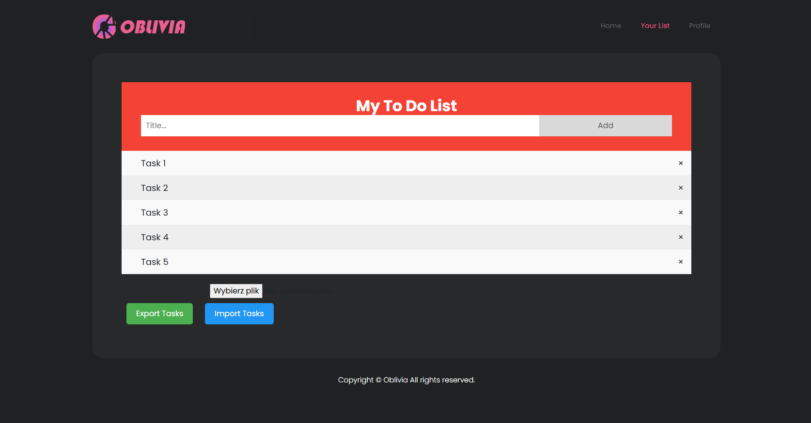

# Oblivia - PHP To-Do List Application



## Overview
Oblivia is a PHP-based web application that provides a to-do list functionality with user authentication. The application follows an MVC (Model-View-Controller) architecture pattern and includes features like user registration, login/logout, task management, and data import/export.

## Project Structure

```
project/
├── Assets/             # Static assets (CSS, JS, images)
├── Config/             # Configuration files
│   └── config.php      # Database configuration
├── Controllers/        # Controllers for handling application logic
│   ├── AuthController.php      # User authentication 
│   ├── TaskController.php      # Task management
│   └── UserController.php      # User profile management
├── Models/             # Database models
│   ├── Database.php    # Database connection and query handling
│   ├── Tasks.php       # Task-related database operations
│   └── User.php        # User-related database operations
├── Views/              # User interface templates
│   ├── list.php        # To-do list page
│   ├── loginPage.php   # Login page
│   ├── profile.php     # User profile page
│   └── registerPage.php # Registration page
└── index.php           # Entry point of the application
```

## Features

### User Authentication
- Registration with name, email, and password
- Login with email and password
- Session management for logged-in users
- Secure password hashing
- Logout functionality

### Task Management
- Create new tasks
- View list of tasks
- Mark tasks as completed/uncompleted
- Delete tasks
- Export tasks to JSON
- Import tasks from JSON

### Security Measures
- Input validation and sanitization
- Prepared SQL statements to prevent SQL injection
- Password hashing
- Session security
- CSRF protection through form validation

## Database Structure

The application uses MySQL with the following tables:

### users
- id (Primary Key)
- name
- email (Unique)
- password (hashed)

### tasks
- id (Primary Key)
- user_id (Foreign Key)
- task (text)
- is_completed (boolean)

### logged_in_users
- id (Primary Key)
- user_id (Foreign Key)
- login_time (timestamp)

## Setup Instructions

1. **Database Configuration**
   - Create a MySQL database named `projekt_php`
   - Update database connection details in `Config/config.php` if needed

2. **Database Schema**
   - Create the necessary tables:

```sql
CREATE TABLE users (
    id INT AUTO_INCREMENT PRIMARY KEY,
    name VARCHAR(50) NOT NULL,
    email VARCHAR(100) UNIQUE NOT NULL,
    password VARCHAR(255) NOT NULL
);

CREATE TABLE tasks (
    id INT AUTO_INCREMENT PRIMARY KEY,
    user_id INT NOT NULL,
    task TEXT NOT NULL,
    is_completed TINYINT DEFAULT 0,
    FOREIGN KEY (user_id) REFERENCES users(id) ON DELETE CASCADE
);

CREATE TABLE logged_in_users (
    id INT AUTO_INCREMENT PRIMARY KEY,
    user_id INT NOT NULL,
    login_time TIMESTAMP DEFAULT CURRENT_TIMESTAMP,
    FOREIGN KEY (user_id) REFERENCES users(id) ON DELETE CASCADE
);
```

3. **Server Configuration**
   - Set up a PHP server (Apache/Nginx) with PHP 7.4+ support
   - Make sure the project is accessible from the web server root

## Technical Implementation Details

### Authentication Flow
1. User registers or logs in through the respective forms
2. Credentials are validated and sanitized
3. On successful authentication, a session is created and user ID is stored
4. The user is also tracked in the `logged_in_users` table
5. Protected routes check for valid session and logged-in status

### Task Management Flow
1. Ajax requests handle task operations (add, update, delete)
2. Task operations are only permitted for authenticated users
3. Each task is associated with the user who created it
4. Tasks can be exported to JSON and imported from JSON files

### Security Considerations
- Passwords are securely hashed using PHP's `password_hash()` function
- All user inputs are sanitized to prevent XSS attacks
- Prepared statements are used for all database queries to prevent SQL injection
- User authentication is checked for all protected routes

## Frontend Components
- Bootstrap framework for responsive design
- Custom CSS for styling
- JavaScript/jQuery for dynamic interactions
- AJAX for asynchronous data operations

## Dependencies
- PHP 7.4+
- MySQL/MariaDB
- Bootstrap CSS framework
- jQuery JavaScript library

## Development Notes
- The application follows an MVC architecture for clean separation of concerns
- Error handling is implemented with try-catch blocks and appropriate user feedback
- Session management includes security considerations like session hijacking prevention